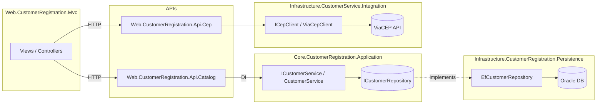

# 📇 Customer Registration

## 📌 Sobre o Projeto
O **Customer Registration** é uma solução em **.NET** que centraliza o **cadastro de clientes** e a **consulta de endereços por CEP**. A arquitetura é organizada em **múltiplos projetos** e camadas bem definidas:

- **APIs**:
  - `Web.CustomerRegistration.Api.Catalog`: expõe endpoints REST para **clientes**.
  - `Web.CustomerRegistration.Api.Cep`: expõe endpoint REST para **consulta de CEP** (compatível com o formato ViaCEP).
- **Camada de Aplicação / Domínio**: `Core.CustomerRegistration.Application` — contratos e orquestração de casos de uso.
- **Persistência (EF Core + Oracle)**: `Infrastructure.CustomerRegistration.Persistence` — mapeamentos, `DbContext` e repositórios.
- **Integrações externas**: `Infrastructure.CustomerService.Integration` — cliente HTTP para provedores de CEP.
- **Contratos (DTOs)**: `Shared.CustomerRegistration.Contracts` — requests/responses compartilhados entre camadas.
- **Interface Web (MVC)**: `Web.CustomerRegistration.Mvc` — UI interna para operar as APIs.

> **Observação**: o repositório contém **duas APIs** (Clientes e CEP) e **uma aplicação MVC** — não há “catálogo de produtos”.

---

## 🏢 Aplicação Interna
A aplicação foi pensada para uso **interno**: operadores podem **cadastrar/listar clientes** e **preencher endereço automaticamente** a partir do CEP, reduzindo erros de digitação e acelerando o fluxo de registro. Todas as operações passam pelas **APIs** dedicadas e seguem uma separação clara de responsabilidades.

---

## 🔗 Rotas da API

### 👥 Clientes (API Catalog)
**Método** | **Rota** | **Descrição** | **Status HTTP Esperado**
---|---|---|---
GET | `/api/customers` | Lista todos os clientes | 200 OK
GET | `/api/customers/{id}` | Obtém um cliente pelo **ID** | 200 OK / 404 Not Found
POST | `/api/customers` | Cria um novo cliente | 201 Created / 400 Bad Request

### 📫 CEP (API Cep)
**Método** | **Rota** | **Descrição** | **Status HTTP Esperado**
---|---|---|---
GET | `/api/cep/{cep}` | Retorna dados do endereço no **mesmo formato do ViaCEP** | 200 OK / 404 Not Found

**Formato esperado (compatível ViaCEP):**
```json
{
  "cep": "08280-260",
  "logradouro": "Rua Dominiciano Ribeiro",
  "bairro": "Cidade Líder",
  "localidade": "São Paulo",
  "uf": "SP"
}
```

> Caso o CEP não exista/ seja inválido, a API retorna `404 Not Found`.

---

## 📋 Pré‑requisitos
- **.NET SDK 8.0+** instalado
- **Oracle** acessível (instância/serviço) para persistência
- Ferramenta de banco (opcional): *SQL Developer*, *DBeaver* etc.

---

## ⚙️ Como Instalar e Rodar

1) **Clonar o repositório**
```bash
git clone https://github.com/pedroonovais/customer-registration.git
cd customer-registration
```

2) **Configurar a conexão com Oracle (API de Clientes)**
Edite o `appsettings.json` da **API de Clientes** para definir a string de conexão (exemplo de chave):
```json
"ConnectionStrings": {
  "Default": "User Id=<usuario>;Password=<senha>;Data Source=//<host>:<porta>/<ServiceName>;"
}
```
> Você pode optar por Secret Manager/variáveis de ambiente para não versionar credenciais.

3) **Aplicar migrations e subir as APIs**
```bash
# Cria/atualiza o schema no Oracle
dotnet ef database update -p Infrastructure.CustomerRegistration.Persistence -s Web.CustomerRegistration.Api.Catalog

# Sobe a API de Clientes (Catalog)
dotnet run --project Web.CustomerRegistration.Api.Catalog

# Em outro terminal, sobe a API de CEP
dotnet run --project Web.CustomerRegistration.Api.Cep
```

4) **Acessar Swagger**
- **API de Clientes**: `http://localhost:{porta}/swagger`
- **API de CEP**: `http://localhost:{porta}/swagger`

> As portas dependem do `launchSettings.json`/configuração local.

---

## ✅ Exemplo de Fluxo

**1. Consultar CEP (antes do cadastro)**
```http
GET /api/cep/08280260
```
*Resposta:* JSON compatível com ViaCEP ou **404**.

**2. Criar cliente**
```http
POST /api/customers
Content-Type: application/json

{
  "name": "João Silva",
  "email": "joao.silva@example.com",
  "occupation": "Engenheiro"
}
```
*Resposta:* **201 Created** com o `id` (GUID) gerado.

**3. Consultar cliente por ID**
```http
GET /api/customers/{id}
```

---

## 📐 Princípios SOLID Aplicados

- **SRP — Single Responsibility Principle**  
  - *Controllers* das APIs tratam **apenas HTTP** (roteamento, status codes).  
  - **Serviços de aplicação** (`Core.CustomerRegistration.Application`) concentram **regras/uso** do domínio (ex.: criar/consultar cliente).  
  - **Repositórios** em `Infrastructure.CustomerRegistration.Persistence` cuidam **exclusivamente** da persistência (EF Core/Oracle).  
  - **Clientes de integração** em `Infrastructure.CustomerService.Integration` encapsulam chamadas a provedores externos (CEP).  
  > Cada classe tem uma **responsabilidade única**, facilitando leitura, testes e manutenção.

- **OCP — Open/Closed Principle**  
  - Os serviços dependem de **interfaces** (ex.: `ICustomerRepository`, `ICepClient`), permitindo **extender** comportamento trocando/adição de implementações **sem modificar** o código existente.  
  - Para usar outro provedor de CEP ou outro banco, basta criar uma **nova implementação** da interface e registrá‑la no DI.

- **DIP — Dependency Inversion Principle**  
  - Camadas de alto nível (controllers/serviços) dependem de **abstrações**, não de detalhes concretos.  
  - Implementações de baixo nível (EF Core, HTTP clients) **implementam** essas interfaces e são **injetadas** via DI nos projetos de API.  
  > O acoplamento fica **baixo**, e detalhes podem mudar sem impactar o core do sistema.

---

## 🧭 Estrutura (visão geral)
```
customer-registration/
├── Core.CustomerRegistration.Application
├── Infrastructure.CustomerRegistration.Persistence
├── Infrastructure.CustomerService.Integration
├── Shared.CustomerRegistration.Contracts
├── Web.CustomerRegistration.Api.Catalog
├── Web.CustomerRegistration.Api.Cep
└── Web.CustomerRegistration.Mvc
```

---

## 🗺️ Diagrama de Arquitetura (Mermaid)



---

## 🧪 Boas práticas
- **Swagger** habilitado nas duas APIs (`/swagger`).
- **Validações** e mensagens de erro claras (400/404/201 etc.).
- **DTOs** dedicados em `Shared.CustomerRegistration.Contracts` para desacoplar camadas.
- **DI** configurada nos projetos de API para serviços/repositórios/integrações.

---

> Qualquer dúvida ou ajuste fino (ex.: portas, nomes de connection string), veja o `launchSettings.json` e os `appsettings*.json` de cada projeto.
